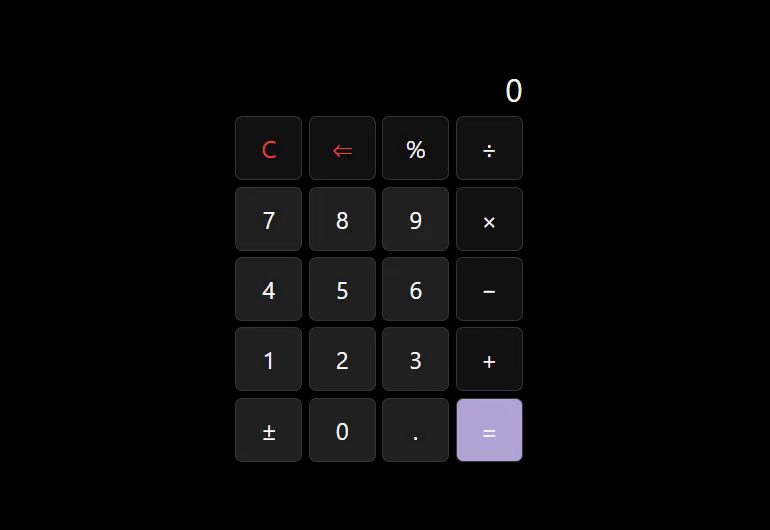

# Calculator

This project is a part of [The Odin Project's Foundations course](https://www.theodinproject.com/paths/foundations/courses/foundations).

> [Live Demo](https://lernywensi.github.io/calculator)

## Built with

-   HTML
-   CSS
-   JavaScript

## Features

-   Perform basic operations
-   Accept input directly from the keyboard
-   Continuously show the current expression
-   Switch operators within an expression without needing to restart
-   Enable further calculations after obtaining a result

## Preview | [Live](https://lernywensi.github.io/calculator)

